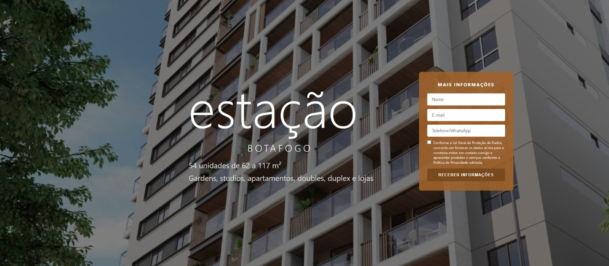
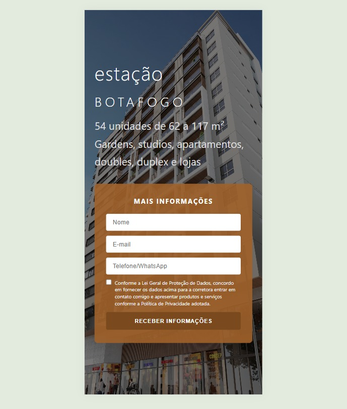
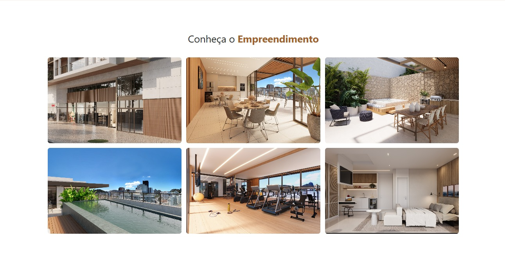
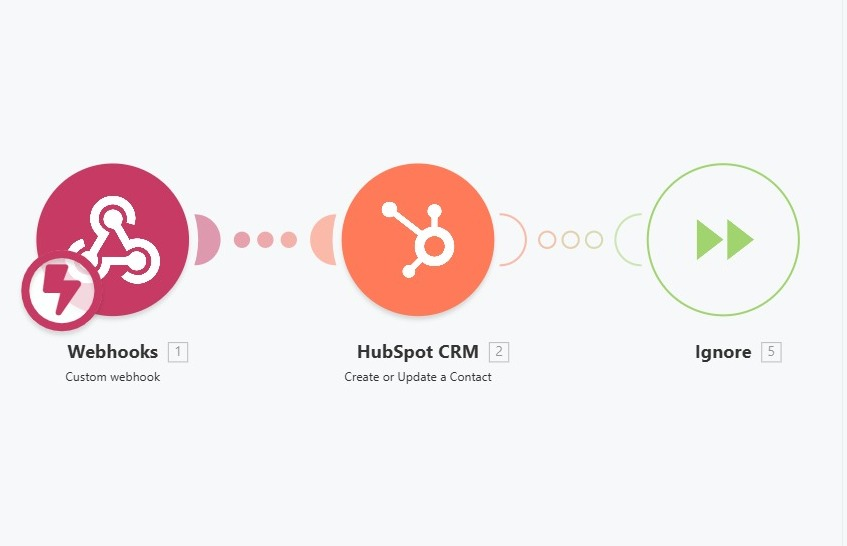

# 🏠 Sistema de Captação de Leads para Imobiliária

Projeto real desenvolvido para uma corretora de imóveis com foco em geração, captura e gestão de leads utilizando landing page otimizada e automações integradas.

---

## 🚀 Demonstração

🔗 https://alegrettoimoveis.netlify.app

---

## 🧩 Funcionalidades

- Landing page responsiva
- Integração com WhatsApp via JavaScript
- Formulário de captura de leads
- Integração com Meta Pixel (evento Lead)
- Automação via webhook (Make)
- Integração com CRM (HubSpot)
- Backup de leads via Formspree

---

## ⚙️ Tecnologias utilizadas

- HTML5
- CSS3
- JavaScript (Vanilla)
- API Fetch
- Webhooks
- Meta Pixel API
- Make (Integromat)
- HubSpot CRM
- Formspree
- Netlify

---

## 🔄 Fluxo do sistema

1. Usuário acessa a landing page  
2. Preenche o formulário  
3. Dados enviados via webhook  
4. Make processa a automação  
5. Lead salvo no HubSpot  
6. Backup armazenado no Formspree  
7. Evento enviado ao Meta Pixel  

---

## 📌 Contexto do projeto

Projeto desenvolvido para cliente real, com foco em performance, conversão e integração com ferramentas de marketing digital.

---

## 📷 Preview

### 🏠 Página inicial (Desktop)

### 📱 Versão Mobile

### 📝 Formulário de captação

### 🖼️ Galeria de imagens

## 🔄 Automação

